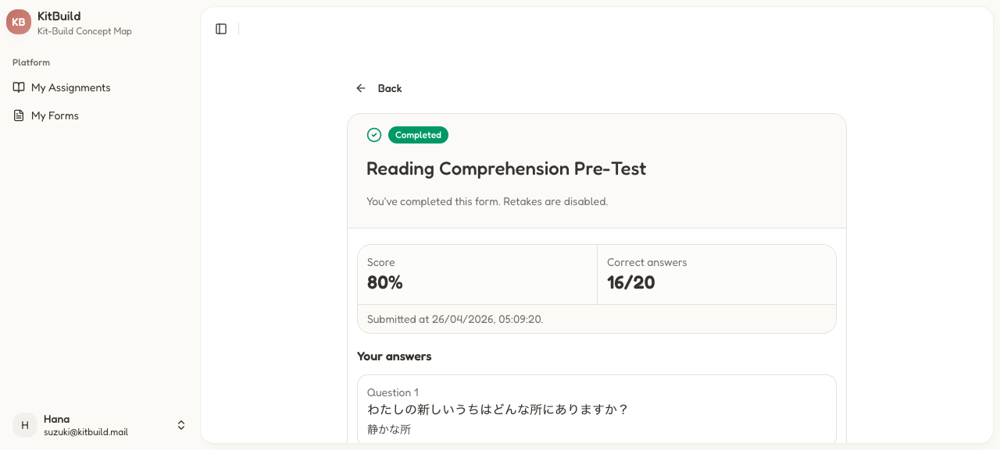
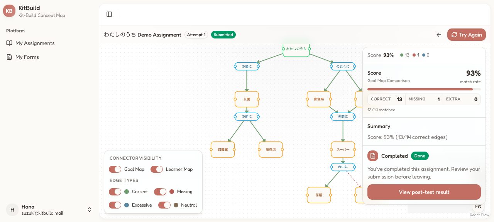

# Student Guide

## Table of Contents

1. [Login](#login)
2. [Sign Up](#sign-up)
3. [My Assignments (Dashboard)](#my-assignments-dashboard)
4. [My Forms](#my-forms)
5. [Taking a Form](#taking-a-form)
6. [Viewing Form Results](#viewing-form-results)
7. [Kit-Build Concept Map](#kit-build-concept-map)
8. [Learner Map Result & Diagnosis](#learner-map-result--diagnosis)
9. [Profile](#profile)

---

## Login

**Route:** `/login`
**Title:** "Sign In - KitBuild"

**Components:**

| Element                | Type            | Description                                                                                                                                                         |
| ---------------------- | --------------- | ------------------------------------------------------------------------------------------------------------------------------------------------------------------- |
| **Brand bar**          | `div`           | KB logo + "KitBuild" heading + "Sign in with your student ID / email" subtitle                                                                                      |
| **Error banner**       | `div`           | Red-bordered alert shown on auth failure. Messages: "Incorrect student ID/email or password", "Account not found", "Too many attempts", "Network error"             |
| **Student ID / Email** | `Input`         | Text input. Accepts student IDs (e.g., `244206020055`) or email (e.g., `tanaka@kitbuild.mail`). Student IDs are auto-converted to email format `{id}@kitbuild.mail` |
| **Password**           | `PasswordInput` | Password input with show/hide toggle. Minimum 8 characters                                                                                                          |
| **Sign in**            | `Button`        | Primary CTA. Disabled until form validates. Shows "Signing in..." during submission                                                                                 |
| **Sign up here**       | `Link`          | Navigates to `/signup`                                                                                                                                              |

**States:**

- **Default**: Empty form, button disabled
- **Filled**: Button enabled after validation
- **Submitting**: "Signing in..." text, button disabled
- **Error**: Red banner with message, form stays filled
- **Success**: Redirect to `/dashboard/assignments` (student) or `/dashboard` (teacher/admin)

---

## Sign Up

**Route:** `/signup`
**Title:** "Sign Up - KitBuild"

Multi-step registration with 4 steps. A horizontal stepper shows progress:

- **Whitelist** (User icon) — Pick your reserved account
- **Personal** (Book icon) — Tell us about yourself
- **Academic** (School icon) — Review student ID & cohort
- **Consent** (Check icon) — Research participation agreement

Completed steps have filled primary color; active step has ring highlight; future steps are dimmed.

### Step 1: Whitelist

| Component            | Type               | Details                                                                                                                |
| -------------------- | ------------------ | ---------------------------------------------------------------------------------------------------------------------- |
| **Reserved Account** | `SearchableSelect` | Combobox with 47+ pre-registered student entries. Options show `Name (StudentID)`. Filter by typing. Grouped by cohort |
| **Password**         | `PasswordInput`    | Minimum 8 characters. Show/hide toggle                                                                                 |
| **Confirm Password** | `PasswordInput`    | Must match password                                                                                                    |
| **Next**             | `Button`           | Disabled until: student selected, password filled, passwords match, no errors                                          |

**Validation:** password ≥ 8 chars, confirmPassword === password, studentId non-empty

### Step 2: Personal

| Component                    | Type               | Notes                    |
| ---------------------------- | ------------------ | ------------------------ |
| **Age**                      | `Input number`     | Optional                 |
| **JLPT Level**               | `SearchableSelect` | None, N5, N4, N3, N2, N1 |
| **Months Learning Japanese** | `Input number`     | Optional                 |
| **Previous Japanese Score**  | `Input number`     | Optional, 0–100          |
| **Hours/Week Media**         | `Input number`     | Optional                 |
| **Motivation**               | `Input text`       | Optional free text       |

**Next guard:** Age filled + JLPT selected

### Step 3: Academic

| Component      | Type                        | Notes                                                         |
| -------------- | --------------------------- | ------------------------------------------------------------- |
| **Student ID** | `Input disabled`            | Read-only from whitelist                                      |
| **Cohort**     | `SearchableSelect` or `div` | Auto-assigned from whitelist if available, otherwise dropdown |

**Cohort auto-assignment:** When a whitelist entry has a cohort, it shows as a read-only badge. The form also uses whitelist cohort as fallback.

### Step 4: Consent

| Component                | Type       | Notes                                                              |
| ------------------------ | ---------- | ------------------------------------------------------------------ |
| **Information headings** | `div`      | Data Collection, Data Protection, Publication, Withdrawal, Privacy |
| **Consent checkbox**     | `Checkbox` | Required                                                           |
| **Create Account**       | `Button`   | Disabled until checked                                             |

**On submit:**

1. Form validates (password match, consent given)
2. Server creates user via Better Auth
3. User added to cohort
4. Whitelist entry claimed
5. Success toast → redirect to `/login`

---

## My Assignments (Dashboard)

**Route:** `/dashboard/assignments`
**Title:** "Dashboard - KitBuild"

**Sidebar:**

| Component          | Description                                                    |
| ------------------ | -------------------------------------------------------------- |
| **My Assignments** | `Link` — Current page                                          |
| **My Forms**       | `Link` → `/dashboard/forms/student`                            |
| **User menu**      | `Button` — Avatar initial + name/email. Dropdown with sign out |
| **Toggle Sidebar** | `Button` × 2 — Collapse/expand                                 |

**Main content:**

| Component    | Description                                    |
| ------------ | ---------------------------------------------- |
| **Heading**  | "My Assignments"                               |
| **Subtitle** | "View and complete your assigned concept maps" |

**Assignment card** (one per assignment):

| Field           | Description                                        |
| --------------- | -------------------------------------------------- |
| **Status**      | "Submitted" (green) or "Not Started" (muted)       |
| **Title**       | e.g., "わたしのうち Demo Assignment"               |
| **Description** | Reading passage summary                            |
| **Topic**       | e.g., "わたしのうち"                               |
| **Date**        | e.g., "May 17, 2026"                               |
| **Attempt**     | e.g., "Attempt 1" (when submitted)                 |
| **CTA**         | "Start" (not started) or "Show Result" (submitted) |

**States:**

- **Loading**: Skeleton cards
- **Empty**: "No assignments yet" + description
- **Error**: Error card with retry

---

## My Forms

**Route:** `/dashboard/forms/student`
**Title:** "Dashboard - KitBuild"

| Component    | Description                                              |
| ------------ | -------------------------------------------------------- |
| **Heading**  | "My Forms"                                               |
| **Subtitle** | "Complete your assigned forms to progress in the course" |

**Sections:** "Available Forms" and "Completed Forms"

**Form card** (repeated):

| Field           | Description                                              |
| --------------- | -------------------------------------------------------- |
| **Title**       | e.g., "Reading Comprehension Pre-Test"                   |
| **Description** | Purpose, question count, passage info                    |
| **Type badge**  | "Pre-Test", "Post-Test", "Questionnaire", "Delayed-Test" |
| **CTA**         | "Start Form" (available) or "View Result" (completed)    |

**Form type priority order:**

1. `pre_test` — Baseline comprehension
2. `post_test` — Immediate outcome
3. `tam` — Technology Acceptance Model
4. `questionnaire` — Open-ended feedback
5. `delayed_test` — Retention

**Access control:** Forms filtered by published status, assignment linkage, cohort targeting, study group.

---

## Taking a Form

**Route:** `/dashboard/forms/take?formId={id}`
**Title:** "Dashboard - KitBuild"

**Header bar:**

| Component      | Description                |
| -------------- | -------------------------- |
| **Title**      | Form title                 |
| **Progress**   | "X of 20 answered" counter |
| **Last saved** | Auto-save timestamp        |

**Reading Material Sidebar** (comprehension tests only):

| Component          | Description                 |
| ------------------ | --------------------------- |
| **Heading**        | "Reading Material"          |
| **Passage title**  | e.g., "わたしのうち"        |
| **Content**        | Japanese text with furigana |
| **Question range** | "Questions 1–20"            |

**Question list** (all on one scrollable page):

| Component           | Description                                               |
| ------------------- | --------------------------------------------------------- |
| **Question number** | Sequential                                                |
| **Question text**   | Japanese with `*` for required                            |
| **Options**         | 4 `Button` elements per MCQ. Selected gets active styling |
| **Progress bar**    | Visual answered/total                                     |

**Footer:**

| Component  | Description                                      |
| ---------- | ------------------------------------------------ |
| **Submit** | `Button` — Disabled until ALL required answered. |

**States:**

- **No formId**: "No form specified" + back link
- **Loading**: Centered spinner
- **Error**: "Failed to load form" + retry/back
- **Already submitted**: Shows `SubmissionReview`
- **Submitting**: Success confirmation

**Auto-save:** Drafts saved to localStorage on change. Restored on refresh. Cleared after submit.

---

## Viewing Form Results

After submission, the `SubmissionReview` component displays:

| Component           | Description                                                                                  |
| ------------------- | -------------------------------------------------------------------------------------------- |
| **Back button**     | `Button` with arrow → `/dashboard/forms/student` (or `/dashboard/assignments` for post-test) |
| **Completed badge** | Green "Completed" with checkmark                                                             |
| **Title**           | Form title                                                                                   |
| **Description**     | "You've completed this form. Retakes are disabled."                                          |
| **Score card**      | Score % (or "Submitted" for non-scored) + Correct `X/Y`                                      |
| **Submission time** | e.g., "Submitted at 10/05/2026, 05:16:06."                                                   |
| **Your answers**    | Per-question review. Each shows: question number, question text, selected answer text        |
| **Back link**       | Full-width button → back to forms/assignments                                                |

---

## Kit-Build Concept Map

**Route:** `/dashboard/learner-map/{assignmentId}`
**Title:** "Dashboard - KitBuild"

Interactive concept map editor using React Flow.

**Toolbar:**

| Component            | Description                          |
| -------------------- | ------------------------------------ |
| **Assignment title** | e.g., "わたしのうち Demo Assignment" |
| **Progress**         | "X connections" counter              |
| **Submit**           | `Button` — Submit map for diagnosis  |
| **Toolbar buttons**  | Undo, redo, zoom, layout             |

**Canvas elements:**

| Element             | Description                                                                          |
| ------------------- | ------------------------------------------------------------------------------------ |
| **Concept nodes**   | Draggable round nodes. Represent places (公園, 図書館, スーパー, etc.)               |
| **Connector nodes** | Draggable rounded nodes. Location grammar (の隣に, の近くに, の前に, の間に, の中に) |
| **Edges**           | Directed connections. Drawn by dragging from output handle to input handle           |
| **Node handles**    | Connection points on each node                                                       |

**Interactions:**

- Drag nodes to reposition
- Drag handle → handle to create edge
- Select to delete/inspect
- Pan canvas by dragging empty space
- Zoom with scroll/toolbar

**Constraints:** Students can only arrange and connect provided parts. No new node creation.

---

## Learner Map Result & Diagnosis

**Route:** `/dashboard/learner-map/{assignmentId}/result`
**Title:** "Dashboard - KitBuild"

**Header bar:**

| Component                           | Description                                               |
| ----------------------------------- | --------------------------------------------------------- |
| **Title**                           | Assignment title                                          |
| **Attempt badge**                   | e.g., "Attempt 1"                                         |
| **Status badge**                    | "Submitted" (green)                                       |
| **Back** → `/dashboard/assignments` | Arrow icon button                                         |
| **Try Again**                       | `Button` — New attempt (increments count, reset to draft) |

**Canvas** (React Flow with edge classification):

| Edge color     | Meaning                                |
| -------------- | -------------------------------------- |
| **Green**      | Correct — in both learner and goal map |
| **Red dashed** | Missing — in goal map only             |
| **Orange**     | Excessive — in learner map only        |
| **Gray**       | Neutral — non-scored                   |

**Canvas controls:**

| Component    | Description                |
| ------------ | -------------------------- |
| **Zoom In**  | `Button`                   |
| **Zoom Out** | `Button`                   |
| **Fit**      | `Button` — Auto-fit canvas |

**Visibility toggles:**

| Toggle          | Effect                     |
| --------------- | -------------------------- |
| **Goal Map**    | Show/hide goal map overlay |
| **Learner Map** | Show/hide learner map      |
| **Correct**     | Show/hide correct edges    |
| **Missing**     | Show/hide missing edges    |
| **Excessive**   | Show/hide excessive edges  |
| **Neutral**     | Show/hide neutral edges    |

**Diagnosis sidebar** (right panel):

| Component             | Description                                                    |
| --------------------- | -------------------------------------------------------------- |
| **Score**             | "X%"                                                           |
| **Edge counts**       | Correct (green), Missing (red), Excessive (orange)             |
| **DiagnosisStats**    | Breakdown: correct/missing/excessive counts, score, match rate |
| **Post-test section** | "View post-test result" / "Take Post-Test" link                |

---

## Profile

**Route:** `/dashboard/profile`
**Title:** "Dashboard - KitBuild"

**Header:**

| Component      | Description          |
| -------------- | -------------------- |
| **Avatar**     | Large initial letter |
| **Name**       | Display name         |
| **Email**      | Email address        |
| **Role**       | "Student" badge      |
| **JLPT Level** | Current level badge  |
| **Sign out**   | `Button`             |

**Edit Profile form:**

| Section                  | Field                      | Type                        |
| ------------------------ | -------------------------- | --------------------------- |
| **PERSONAL INFORMATION** | Name                       | `Input text`                |
|                          | Age                        | `Input number`              |
| **LEARNING PROFILE**     | JLPT Level                 | `Radio group` (None, N5–N1) |
|                          | Duration (months)          | `Input number`              |
|                          | Previous Score (0-100)     | `Input number`              |
|                          | Media Consumption (hrs/wk) | `Input number`              |
|                          | Learning Motivation        | `Input text`                |
|                          | **Cancel**                 | `Link` → dashboard          |
|                          | **Save changes**           | `Button`                    |

**States:**

- **Default**: Pre-filled with current values
- **Saving**: Button disabled, spinner
- **Success**: Toast "Profile updated"
- **Error**: Toast with error message
