# Student Guide

## Table of Contents

1. [Login](#login)
2. [Sign Up](#sign-up)
3. [My Assignments (Dashboard)](#my-assignments-dashboard)
4. [My Forms](#my-forms)
5. [Taking the Pre-Test](#taking-the-pre-test)
6. [Kit-Build Concept Map](#kit-build-concept-map)
7. [Taking the Post-Test](#taking-the-post-test)
8. [TAM Questionnaire](#tam-questionnaire)
9. [Feedback Questionnaire](#feedback-questionnaire)
10. [Delayed Test](#delayed-test)
11. [Viewing Form Results](#viewing-form-results)
12. [Learner Map Result & Diagnosis](#learner-map-result--diagnosis)
13. [Profile](#profile)

---

## Login

**Route:** `/login`
**Title:** "Sign In - KitBuild"

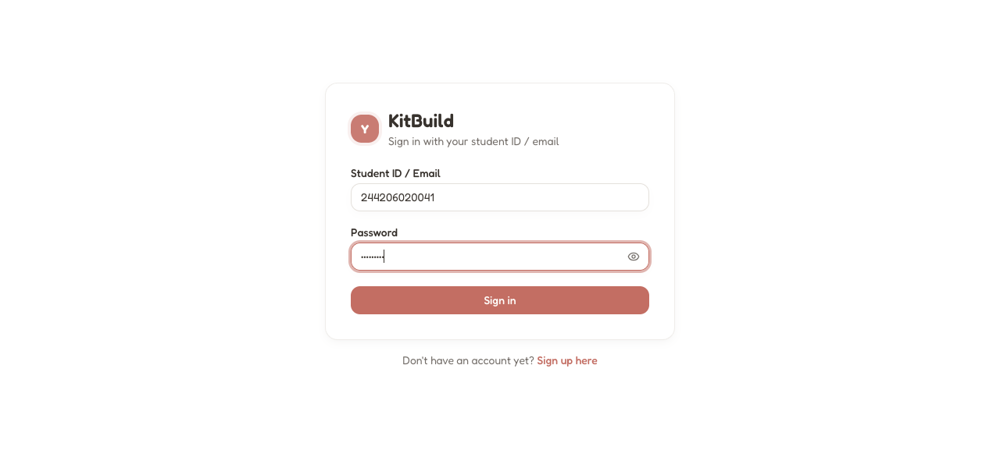

**Components:**

| Element                | Type            | Description                                                                                                                                                         |
| ---------------------- | --------------- | ------------------------------------------------------------------------------------------------------------------------------------------------------------------- |
| **Brand bar**          | `div`           | KB logo + "KitBuild" heading + "Sign in with your student ID / email" subtitle                                                                                      |
| **Error banner**       | `div`           | Red-bordered alert shown on auth failure. Messages: "Incorrect student ID/email or password", "Account not found", "Too many attempts", "Network error"             |
| **Student ID / Email** | `Input`         | Text input. Accepts student IDs (e.g., `244206020055`) or email (e.g., `tanaka@kitbuild.mail`). Student IDs are auto-converted to email format `{id}@kitbuild.mail` |
| **Password**           | `PasswordInput` | Password input with show/hide toggle. Minimum 8 characters                                                                                                          |
| **Sign in**            | `Button`        | Primary CTA. Disabled until form validates. Shows "Signing in..." during submission                                                                                 |
| **Sign up here**       | `Link`          | Navigates to `/signup`                                                                                                                                              |

**States:**

- **Default**: Empty form, button disabled
- **Filled**: Button enabled after validation
- **Submitting**: "Signing in..." text, button disabled
- **Error**: Red banner with message, form stays filled
- **Success**: Redirect to `/dashboard/assignments` (student) or `/dashboard` (teacher/admin)

---

## Sign Up

**Route:** `/signup`
**Title:** "Sign Up - KitBuild"

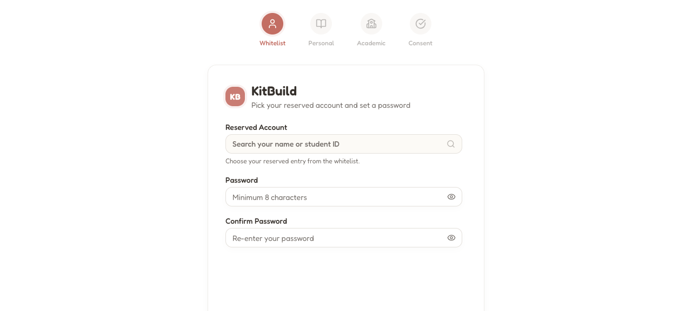

Multi-step registration with 4 steps. A horizontal stepper shows progress:

- **Whitelist** (User icon) — Pick your reserved account
- **Personal** (Book icon) — Tell us about yourself
- **Academic** (School icon) — Review student ID & cohort
- **Consent** (Check icon) — Research participation agreement

Completed steps have filled primary color; active step has ring highlight; future steps are dimmed.

### Step 1: Whitelist

| Component            | Type               | Details                                                                                                                |
| -------------------- | ------------------ | ---------------------------------------------------------------------------------------------------------------------- |
| **Reserved Account** | `SearchableSelect` | Combobox with 47+ pre-registered student entries. Options show `Name (StudentID)`. Filter by typing. Grouped by cohort |
| **Password**         | `PasswordInput`    | Minimum 8 characters. Show/hide toggle                                                                                 |
| **Confirm Password** | `PasswordInput`    | Must match password                                                                                                    |
| **Next**             | `Button`           | Disabled until: student selected, password filled, passwords match, no errors                                          |

**Validation:** password ≥ 8 chars, confirmPassword === password, studentId non-empty

### Step 2: Personal Information

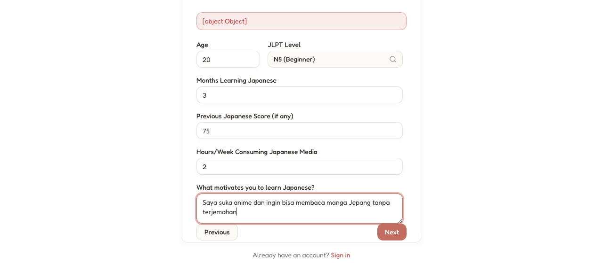

| Component                    | Type               | Notes                    |
| ---------------------------- | ------------------ | ------------------------ |
| **Age**                      | `Input number`     | Optional                 |
| **JLPT Level**               | `SearchableSelect` | None, N5, N4, N3, N2, N1 |
| **Months Learning Japanese** | `Input number`     | Optional                 |
| **Previous Japanese Score**  | `Input number`     | Optional, 0–100          |
| **Hours/Week Media**         | `Input number`     | Optional                 |
| **Motivation**               | `Input text`       | Optional free text       |

**Next guard:** Age filled + JLPT selected

### Step 3: Academic

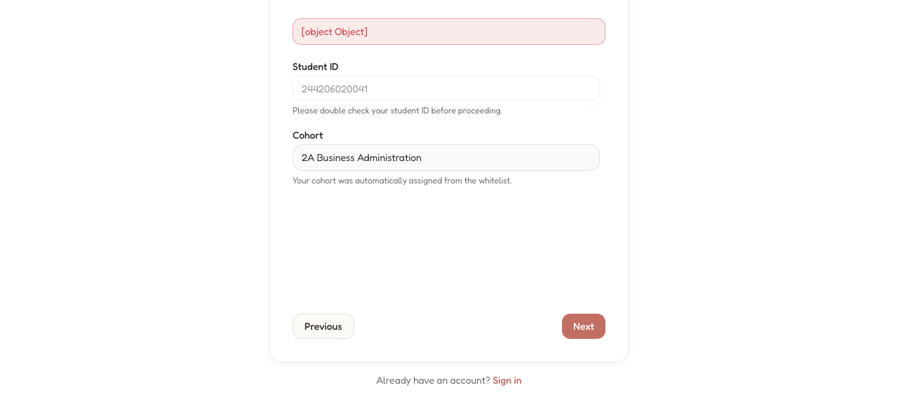

| Component      | Type                        | Notes                                                         |
| -------------- | --------------------------- | ------------------------------------------------------------- |
| **Student ID** | `Input disabled`            | Read-only from whitelist                                      |
| **Cohort**     | `SearchableSelect` or `div` | Auto-assigned from whitelist if available, otherwise dropdown |

**Cohort auto-assignment:** When a whitelist entry has a cohort, it shows as a read-only badge.

### Step 4: Consent

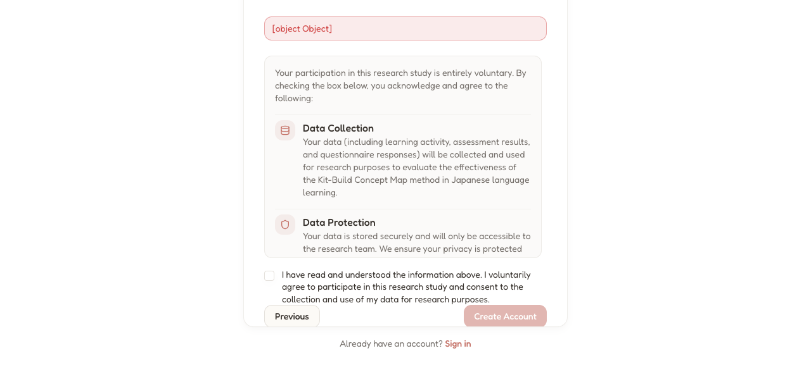

| Component                | Type       | Notes                                                              |
| ------------------------ | ---------- | ------------------------------------------------------------------ |
| **Information headings** | `div`      | Data Collection, Data Protection, Publication, Withdrawal, Privacy |
| **Consent checkbox**     | `Checkbox` | Required                                                           |
| **Create Account**       | `Button`   | Disabled until checked                                             |

**On submit:**

1. Form validates (password match, consent given)
2. Server creates user via Better Auth
3. User added to cohort
4. Whitelist entry claimed
5. Success toast → redirect to `/login`

### Post-Signup

After signing up, you are redirected to the login page. Log in with your student ID and the password you set during registration.

---

## My Assignments (Dashboard)

**Route:** `/dashboard/assignments`
**Title:** "Dashboard - KitBuild"

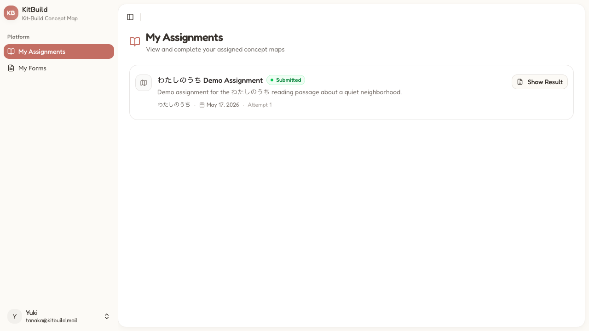

This is the student's landing page after login. It shows all assigned Kit-Build concept map assignments.

**Sidebar:**

| Component          | Description                                                    |
| ------------------ | -------------------------------------------------------------- |
| **My Assignments** | `Link` — Current page                                          |
| **My Forms**       | `Link` → `/dashboard/forms/student`                            |
| **User menu**      | `Button` — Avatar initial + name/email. Dropdown with sign out |
| **Toggle Sidebar** | `Button` × 2 — Collapse/expand                                 |

**Main content:**

| Component    | Description                                    |
| ------------ | ---------------------------------------------- |
| **Heading**  | "My Assignments"                               |
| **Subtitle** | "View and complete your assigned concept maps" |

**Assignment card** (one per assignment):

| Field           | Description                                        |
| --------------- | -------------------------------------------------- |
| **Status**      | "Submitted" (green) or "Not Started" (muted)       |
| **Title**       | e.g., "わたしのうち Assignment"                    |
| **Description** | Reading passage summary                            |
| **Topic**       | e.g., "わたしのうち"                               |
| **Date**        | e.g., "May 17, 2026"                               |
| **Attempt**     | e.g., "Attempt 1" (when submitted)                 |
| **CTA**         | "Start" (not started) or "Show Result" (submitted) |

**States:**

- **Loading**: Skeleton cards
- **Empty**: "No assignments yet" + description
- **Error**: Error card with retry

---

## My Forms

**Route:** `/dashboard/forms/student`
**Title:** "Dashboard - KitBuild"

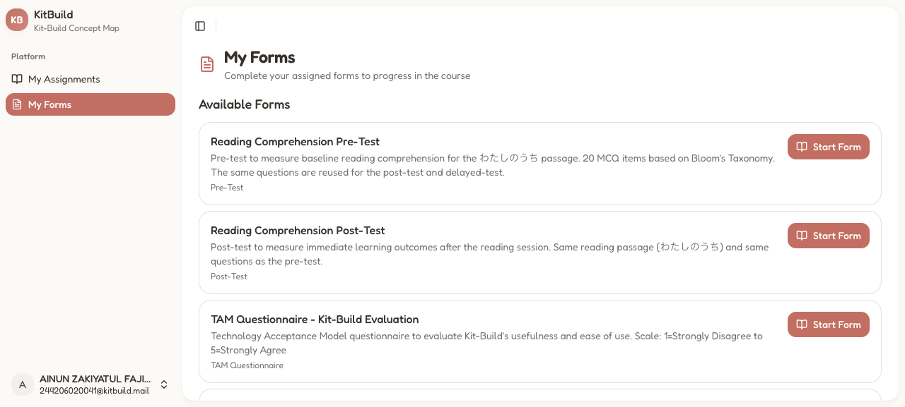

| Component    | Description                                              |
| ------------ | -------------------------------------------------------- |
| **Heading**  | "My Forms"                                               |
| **Subtitle** | "Complete your assigned forms to progress in the course" |

**Sections:** "Available Forms" and "Completed Forms"

**Form card** (repeated):

| Field           | Description                                              |
| --------------- | -------------------------------------------------------- |
| **Title**       | e.g., "Reading Comprehension Pre-Test"                   |
| **Description** | Purpose, question count, passage info                    |
| **Type badge**  | "Pre-Test", "Post-Test", "Questionnaire", "Delayed-Test" |
| **CTA**         | "Start Form" (available) or "View Result" (completed)    |

**Form type priority order:**

1. `pre_test` — Baseline comprehension
2. `post_test` — Immediate outcome
3. `tam` — Technology Acceptance Model
4. `questionnaire` — Open-ended feedback
5. `delayed_test` — Retention

**Access control:** Forms filtered by published status, assignment linkage, cohort targeting, study group.

**Complete flow:** Forms become available as you progress:

1. Pre-Test is available from the start
2. Post-Test becomes available after completing the Kit-Build assignment
3. TAM + Feedback become available after completing the Post-Test
4. Delayed Test becomes available after completing the Post-Test
5. After completing all forms, the experiment flow is finished

---

## Taking the Pre-Test

**Route:** `/dashboard/forms/take?formId={id}`
**Title:** "Dashboard - KitBuild"

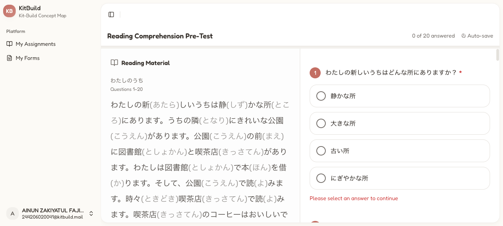

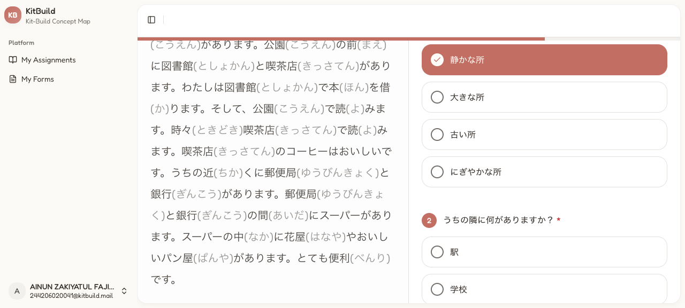

**Header bar:**

| Component      | Description                      |
| -------------- | -------------------------------- |
| **Title**      | "Reading Comprehension Pre-Test" |
| **Progress**   | "0 of 20 answered" counter       |
| **Last saved** | Auto-save timestamp              |

**Reading Material Sidebar** (left panel):

| Component          | Description                 |
| ------------------ | --------------------------- |
| **Heading**        | "Reading Material"          |
| **Passage title**  | e.g., "わたしのうち"        |
| **Content**        | Japanese text with furigana |
| **Question range** | "Questions 1–20"            |

**Question area** (right panel, scrollable):

| Component           | Description                                             |
| ------------------- | ------------------------------------------------------- |
| **Question number** | Sequential (1–20)                                       |
| **Question text**   | Japanese with `*` for required                          |
| **Options**         | 4 clickable option buttons per MCQ. Selected gets green |
| **Progress bar**    | Visual bar shows answered/total (top of right panel)    |

**Footer:**

| Component  | Description                                     |
| ---------- | ----------------------------------------------- |
| **Submit** | `Button` — Disabled until ALL required answered |

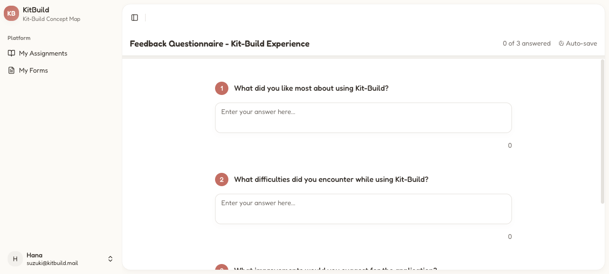

**Passage text** (わたしのうち):

```
わたしの新(あたら)しいうちは静(しず)かな所(ところ)にあります。うちの隣(となり)にきれいな公園(こうえん)があります。
公園(こうえん)の前(まえ)に図書館(としょかん)と喫茶店(きっさてん)があります。わたしは図書館(としょかん)で本(ほん)を借(か)ります。
そして、公園(こうえん)で読(よ)みます。時々(ときどき)喫茶店(きっさてん)で読(よ)みます。喫茶店(きっさてん)のコーヒーはおいしいです。
うちの近(ちか)くに郵便局(ゆうびんきょく)と銀行(ぎんこう)があります。郵便局(ゆうびんきょく)と銀行(ぎんこう)の間(あいだ)にスーパーがあります。
スーパーの中(なか)に花屋(はなや)やおいしいパン屋(ぱんや)があります。とても便利(べんり)です。
```

**20 MCQ Questions** (Bloom's Taxonomy distribution):

| #   | Question                                                         | Correct Answer                                   |
| --- | ---------------------------------------------------------------- | ------------------------------------------------ |
| 1   | わたしの新しいうちはどんな所にありますか？                       | 静かな所                                         |
| 2   | うちの隣に何がありますか？                                       | 公園                                             |
| 3   | 公園の前に何がありますか？                                       | 図書館と喫茶店                                   |
| 4   | わたしは図書館で何をしますか？                                   | 本を借ります                                     |
| 5   | この町で一番おすすめの過ごし方はどれですか。                     | 公園で本を読み、喫茶店でコーヒーを飲む           |
| 6   | わたしはいつもどこで本を読みますか？                             | 公園で                                           |
| 7   | 時々わたしはどこで本を読みますか？                               | 喫茶店で                                         |
| 8   | うちの近くに何がありますか？                                     | 郵便局と銀行                                     |
| 9   | スーパーはどこにありますか？                                     | 郵便局と銀行の間に                               |
| 10  | 本を借りたいとき、わたしはまずどこへ行きますか？                 | 図書館へ                                         |
| 11  | コーヒーを飲みながら本を読みたいとき、わたしはどこへ行きますか？ | 喫茶店へ                                         |
| 12  | パンを買いたいとき、わたしはどこへ行きますか？                   | スーパーへ                                       |
| 13  | 公園の前にあるものは全部でいくつですか？                         | 2つ                                              |
| 14  | うちの近くにあるものとして正しいのはどれですか？                 | 郵便局と銀行                                     |
| 15  | スーパーの中にあるものは何ですか？                               | 花屋とパン屋                                     |
| 16  | この町で、一番いい店はどこですか。                               | 喫茶店                                           |
| 17  | 本を読むとき、いい場所はどこですか。                             | 公園と喫茶店                                     |
| 18  | この町で何ができますか。                                         | 本を借りて、読んで、コーヒーを飲むことができます |
| 19  | 「わたしのうち」の話で地図を作ります。地図の真ん中はどこですか。 | わたしのうち                                     |
| 20  | 友達がこの町のことを聞きました。何と答えますか。                 | 静かで便利な町です                               |

**States:**

- **No formId**: "No form specified" + back link
- **Loading**: Centered spinner
- **Error**: "Failed to load form" + retry/back
- **Already submitted**: Shows `SubmissionReview`
- **Submitting**: Success confirmation

**Auto-save:** Drafts saved to localStorage on change. Restored on refresh. Cleared after submit.

---

## Kit-Build Concept Map

**Route:** `/dashboard/learner-map/{assignmentId}`
**Title:** "Dashboard - KitBuild"

Interactive concept map editor using React Flow. This is where experiment-group students reconstruct the goal map.


**Toolbar:**

| Component            | Description                         |
| -------------------- | ----------------------------------- |
| **Assignment title** | e.g., "わたしのうち Assignment"     |
| **Progress**         | "X connections" counter             |
| **Submit**           | `Button` — Submit map for diagnosis |
| **Toolbar buttons**  | Undo, redo, zoom, layout            |

**Canvas elements:**

| Element             | Description                                                                          |
| ------------------- | ------------------------------------------------------------------------------------ |
| **Concept nodes**   | Draggable round nodes. Represent places (公園, 図書館, スーパー, etc.)               |
| **Connector nodes** | Draggable rounded nodes. Location grammar (の隣に, の近くに, の前に, の間に, の中に) |
| **Edges**           | Directed connections. Drawn by dragging from handle to handle                        |
| **Node handles**    | Connection points on each node (left and right sides)                                |

**Node Types:**

- **Text nodes** (amber border): Concept/place names
- **Connector nodes** (sky blue border): Relationship words

**How to create connections:**

1. Click and hold a **handle** (small circle on the left or right side of a node)
2. Drag to a handle on another node
3. Release to create the connection
4. Each proposition requires 2 connections: concept → connector → concept

**Proposition structure for わたしのうち:**

| #   | Source Node  | Connector Node | Target Node |
| --- | ------------ | -------------- | ----------- |
| 1   | わたしのうち | の隣に         | 公園        |
| 2   | 公園         | の前に         | 図書館      |
| 3   | 公園         | の前に         | 喫茶店      |
| 4   | わたしのうち | の近くに       | 郵便局      |
| 5   | わたしのうち | の近くに       | 銀行        |
| 6   | 郵便局       | の間に         | スーパー    |
| 7   | 銀行         | の間に         | スーパー    |
| 8   | スーパー     | の中に         | 花屋        |
| 9   | スーパー     | の中に         | パン屋      |

**Interactions:**

- Drag nodes to reposition
- Drag handle → handle to create edge
- Select to delete/inspect
- Pan canvas by dragging empty space
- Zoom with scroll/toolbar
- Auto-layout button to reorganize nodes

**Constraints:** Students can only arrange and connect provided parts. No new node creation.

**Submission:**

1. Click "Submit" button
2. Confirm in dialog ("Submit your concept map?")
3. After submission, you're redirected to the result page
4. "Try Again" allows a new attempt (increments attempt count)

---

## Taking the Post-Test

**Route:** `/dashboard/forms/take?formId={id}`

The Post-Test is identical in structure to the Pre-Test: same passage, same 20 MCQ questions, same format. It measures immediate learning outcomes after the Kit-Build session.

**When it becomes available:** After submitting the Kit-Build assignment.

**Scoring:** Same 0-100% scale. Comparison with pre-test measures learning gain.

---

## TAM Questionnaire

**Route:** `/dashboard/forms/take?formId={id}`

**Title:** "TAM Questionnaire - Kit-Build Evaluation"

Technology Acceptance Model questionnaire with 10 Likert-scale items. Available after completing the Post-Test.

**Format:** Radio buttons 1–5 per question (1=Strongly Disagree, 5=Strongly Agree)

**Perceived Usefulness (PU):**

| #   | Question                                                                        |
| --- | ------------------------------------------------------------------------------- |
| 1   | Using Kit-Build improves my reading comprehension                               |
| 2   | Kit-Build helps me understand the structure and relationships in the text       |
| 3   | Kit-Build makes it easier for me to organize information from the reading       |
| 4   | Using Kit-Build helps me learn Japanese reading better than traditional methods |
| 5   | I find Kit-Build useful for my Japanese language learning                       |

**Perceived Ease of Use (PEoU):**

| #   | Question                                                              |
| --- | --------------------------------------------------------------------- |
| 6   | I found Kit-Build easy to use                                         |
| 7   | The interface of Kit-Build is clear and understandable                |
| 8   | Learning to use Kit-Build was quick and easy                          |
| 9   | Connecting concepts in Kit-Build is intuitive                         |
| 10  | My interaction with Kit-Build does not require a lot of mental effort |

**Acceptance criteria:** Mean PU ≥ 3.5 and Mean PEoU ≥ 3.5 indicates positive acceptance.

---

## Feedback Questionnaire

**Route:** `/dashboard/forms/take?formId={id}`

**Title:** "Feedback Questionnaire - Kit-Build Experience"

Three open-ended text fields for qualitative feedback:

| #   | Question                                                   |
| --- | ---------------------------------------------------------- |
| 1   | What did you like most about using Kit-Build?              |
| 2   | What difficulties did you encounter while using Kit-Build? |
| 3   | What improvements would you suggest for the application?   |

---

## Delayed Test

**Route:** `/dashboard/forms/take?formId={id}`

Same format as Pre-Test and Post-Test: same passage (わたしのうち), same 20 MCQ questions. Available after completing the Post-Test.

**Purpose:** Measures long-term memory retention. Comparison with post-test determines the retention decay rate.

**Timing:** Ideally taken one week after the post-test to measure the Ebbinghaus forgetting curve effect.

---

## Viewing Form Results

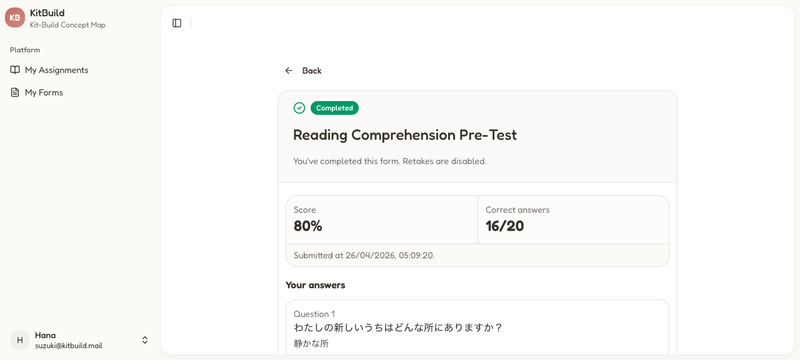

After submission, the `SubmissionReview` component displays:

| Component           | Description                                                                                  |
| ------------------- | -------------------------------------------------------------------------------------------- |
| **Back button**     | `Button` with arrow → `/dashboard/forms/student` (or `/dashboard/assignments` for post-test) |
| **Completed badge** | Green "Completed" with checkmark                                                             |
| **Title**           | Form title                                                                                   |
| **Description**     | "You've completed this form. Retakes are disabled."                                          |
| **Score card**      | Score % + Correct `X/Y`                                                                      |
| **Submission time** | e.g., "Submitted at 10/05/2026, 05:16:06."                                                   |
| **Your answers**    | Per-question review. Each shows: question number, question text, selected answer text        |
| **Back link**       | Full-width button → back to forms/assignments                                                |

For non-scored forms (TAM, Feedback), the score card is replaced with "Submitted".

---

## Learner Map Result & Diagnosis

**Route:** `/dashboard/learner-map/{assignmentId}/result`
**Title:** "Dashboard - KitBuild"

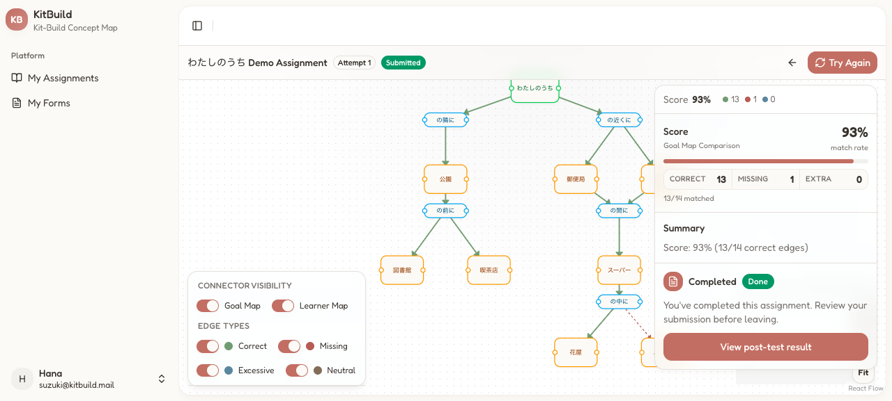

**Header bar:**

| Component                           | Description                                               |
| ----------------------------------- | --------------------------------------------------------- |
| **Title**                           | Assignment title                                          |
| **Attempt badge**                   | e.g., "Attempt 1"                                         |
| **Status badge**                    | "Submitted" (green)                                       |
| **Back** → `/dashboard/assignments` | Arrow icon button                                         |
| **Try Again**                       | `Button` — New attempt (increments count, reset to draft) |

**Canvas** (React Flow with edge classification):

| Edge color     | Meaning                                |
| -------------- | -------------------------------------- |
| **Green**      | Correct — in both learner and goal map |
| **Red dashed** | Missing — in goal map only             |
| **Orange**     | Excessive — in learner map only        |
| **Gray**       | Neutral — non-scored                   |

**Canvas controls:**

| Component    | Description                |
| ------------ | -------------------------- |
| **Zoom In**  | `Button`                   |
| **Zoom Out** | `Button`                   |
| **Fit**      | `Button` — Auto-fit canvas |

**Visibility toggles:**

| Toggle          | Effect                     |
| --------------- | -------------------------- |
| **Goal Map**    | Show/hide goal map overlay |
| **Learner Map** | Show/hide learner map      |
| **Correct**     | Show/hide correct edges    |
| **Missing**     | Show/hide missing edges    |
| **Excessive**   | Show/hide excessive edges  |
| **Neutral**     | Show/hide neutral edges    |

**Diagnosis panel** (right sidebar):

| Component             | Description                                               |
| --------------------- | --------------------------------------------------------- |
| **Score**             | "X%" — percentage of correctly reconstructed propositions |
| **Edge counts**       | Correct (green), Missing (red), Excessive (orange)        |
| **Match rate**        | e.g., "14/14 matched" for perfect reconstruction          |
| **Summary**           | "Correct: X, Missing: Y, Excessive: Z"                    |
| **Post-test section** | "View post-test result" / "Take Post-Test" link           |

---

## Profile

**Route:** `/dashboard/profile`
**Title:** "Dashboard - KitBuild"

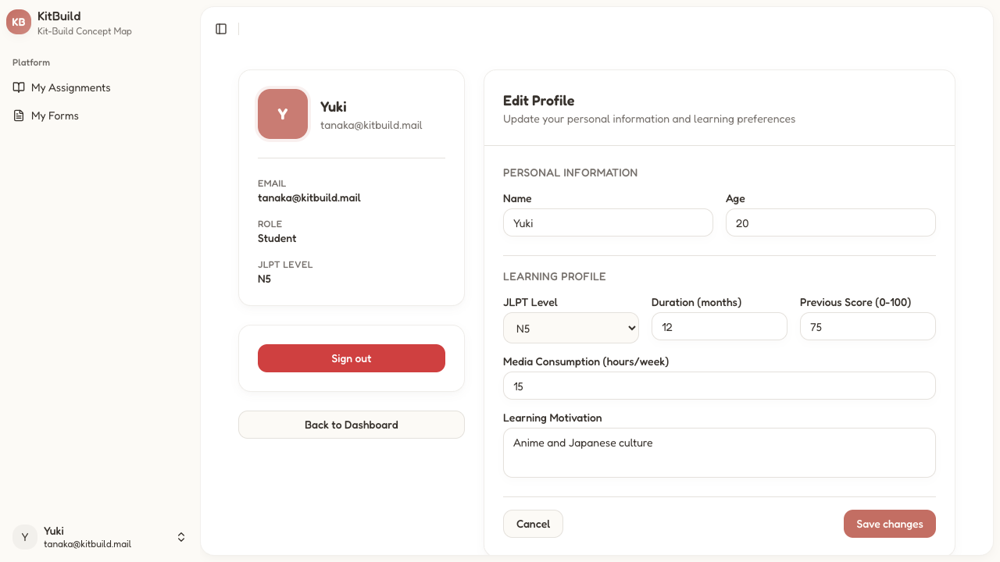

**Header:**

| Component      | Description          |
| -------------- | -------------------- |
| **Avatar**     | Large initial letter |
| **Name**       | Display name         |
| **Email**      | Email address        |
| **Role**       | "Student" badge      |
| **JLPT Level** | Current level badge  |
| **Sign out**   | `Button`             |

**Edit Profile form:**

| Section                  | Field                      | Type                        |
| ------------------------ | -------------------------- | --------------------------- |
| **PERSONAL INFORMATION** | Name                       | `Input text`                |
|                          | Age                        | `Input number`              |
| **LEARNING PROFILE**     | JLPT Level                 | `Radio group` (None, N5–N1) |
|                          | Duration (months)          | `Input number`              |
|                          | Previous Score (0-100)     | `Input number`              |
|                          | Media Consumption (hrs/wk) | `Input number`              |
|                          | Learning Motivation        | `Input text`                |
|                          | **Cancel**                 | `Link` → dashboard          |
|                          | **Save changes**           | `Button`                    |

**States:**

- **Default**: Pre-filled with current values
- **Saving**: Button disabled, spinner
- **Success**: Toast "Profile updated"
- **Error**: Toast with error message
