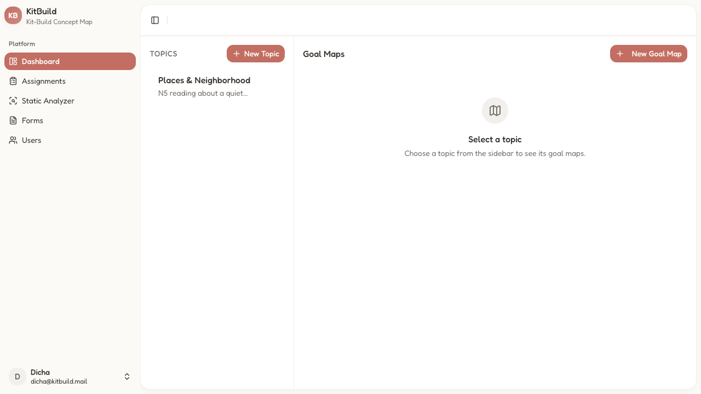
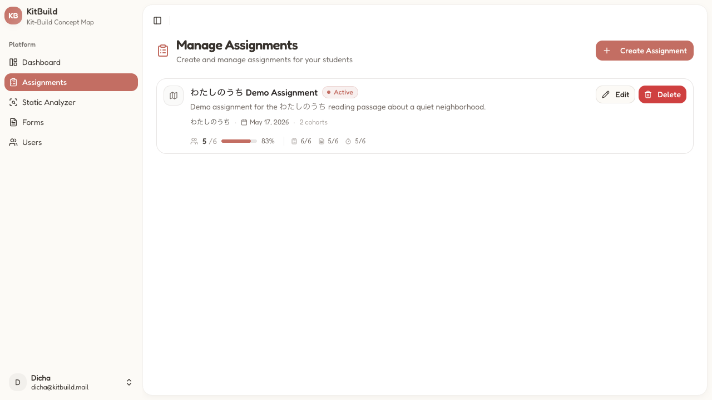
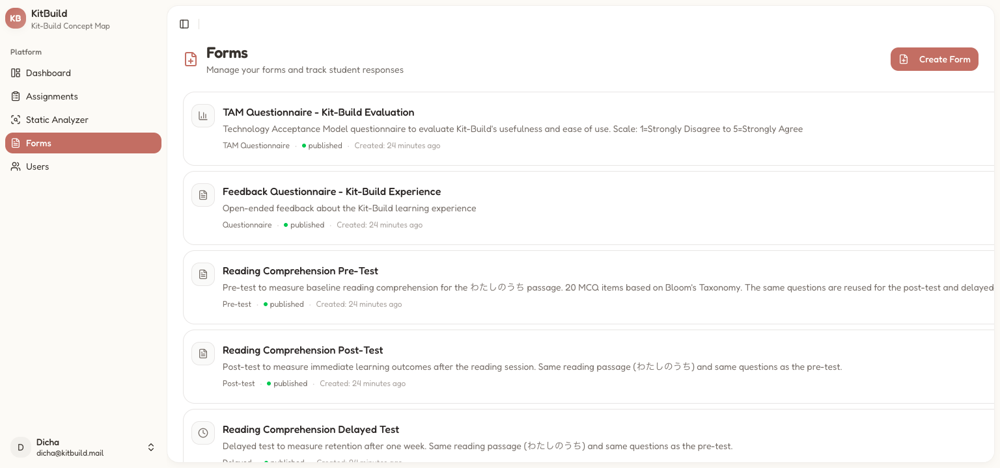
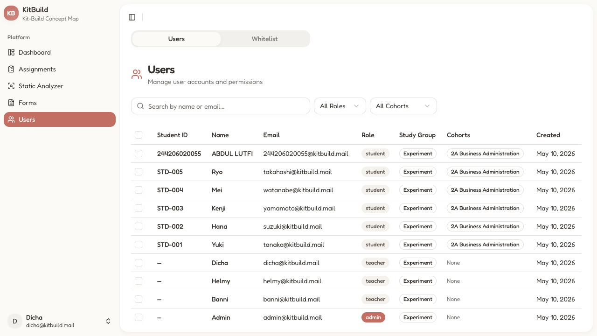

# Teacher Guide

## Table of Contents

1. [Dashboard](#dashboard)
2. [Topics & Goal Maps](#topics--goal-maps)
3. [Assignments Management](#assignments-management)
4. [Forms Management](#forms-management)
5. [Form Builder](#form-builder)
6. [Users & Whitelist](#users--whitelist)
7. [Analytics (Static Analyzer)](#analytics-static-analyzer)

---

## Dashboard

**Route:** `/dashboard`
**Title:** "Dashboard - KitBuild"

**Sidebar:**

| Component           | Route                           | Description                 |
| ------------------- | ------------------------------- | --------------------------- |
| **Dashboard**       | `/dashboard`                    | Topics & goal maps          |
| **Assignments**     | `/dashboard/assignments/manage` | Assignment CRUD             |
| **Static Analyzer** | `/dashboard/analytics`          | Multi-learner comparison    |
| **Forms**           | `/dashboard/forms`              | Form management             |
| **Users**           | `/dashboard/users`              | User & whitelist management |

### Topics Section

| Component      | Description                                                                             |
| -------------- | --------------------------------------------------------------------------------------- |
| **Heading**    | "TOPICS"                                                                                |
| **New Topic**  | `Button` — Opens creation dialog (title, description)                                   |
| **Topic card** | Clickable card showing topic name + description. Click to select and show its goal maps |

### Goal Maps Section

| Component          | Description                                                                            |
| ------------------ | -------------------------------------------------------------------------------------- |
| **Heading**        | "GOAL MAPS"                                                                            |
| **New Goal Map**   | `Link` — Opens goal map editor                                                         |
| **Empty state**    | "Select a topic" prompt when no topic is active                                        |
| **Goal map cards** | Shown when a topic is selected. Each card: title, description, created date, edit link |

---

## Topics & Goal Maps

### Goal Map Editor

**Route:** `/dashboard/goal-map/{goalMapId}`

| Component             | Description                                                                |
| --------------------- | -------------------------------------------------------------------------- |
| **Canvas**            | React Flow graph editor — create, connect, arrange concept/connector nodes |
| **Node palette**      | Add text nodes (concepts) and connector nodes (relationships)              |
| **Toolbar**           | Undo, redo, auto-layout, zoom, save                                        |
| **Reading material**  | Text passage associated with the goal map                                  |
| **Image attachments** | Upload images to reading material sections (e.g., diagrams, illustrations) |

**Goal Map properties:**

| Field     | Description                                     |
| --------- | ----------------------------------------------- |
| **Title** | Name (e.g., "わたしのうち")                     |
| **Topic** | Associated topic                                |
| **Text**  | Reading passage content                         |
| **Nodes** | Array of concept/connector nodes with positions |
| **Edges** | Array of correct propositions (source → target) |

### Goal Map List

**Route:** `/dashboard/goal-map`

Lists all goal maps with search and topic filtering.

---

## Assignments Management

**Route:** `/dashboard/assignments/manage`
**Title:** "Dashboard - KitBuild"

| Component             | Description                                       |
| --------------------- | ------------------------------------------------- |
| **Heading**           | "Manage Assignments"                              |
| **Subtitle**          | "Create and manage assignments for your students" |
| **Create Assignment** | `Button` — Opens creation dialog                  |

### Assignment Card

| Field              | Description                                                                            |
| ------------------ | -------------------------------------------------------------------------------------- |
| **Title**          | Assignment name                                                                        |
| **Status badge**   | "Active" / "Draft" / "Archived"                                                        |
| **Description**    | Reading passage summary                                                                |
| **Topic**          | Associated goal map topic                                                              |
| **Date**           | Creation or update date                                                                |
| **Cohorts**        | Number of targeted cohorts                                                             |
| **Statistics row** | Kit-build completion (X/Y, X%) + pre-test (X/Y) + post-test (X/Y) + delayed test (X/Y) |
| **Edit**           | `Button` — Opens assignment editor                                                     |
| **Delete**         | `Button` — With confirmation dialog                                                    |

### Assignment Creation Dialog

| Field                 | Type             | Description                     |
| --------------------- | ---------------- | ------------------------------- |
| **Title**             | `Input`          | Display name                    |
| **Description**       | `Textarea`       | Brief description               |
| **Goal Map**          | `Select`         | Choose the goal map for the kit |
| **Kit**               | Auto-generated   | Created from goal map           |
| **Pre-Test Form**     | `Select`         | Published pre-test form         |
| **Post-Test Form**    | `Select`         | Published post-test form        |
| **Delayed Test Form** | `Select`         | Published delayed test form     |
| **TAM Form**          | `Select`         | Published TAM questionnaire     |
| **Cohorts**           | `Select` (multi) | Which cohorts receive this      |
| **Reading Material**  | Pre-filled       | From goal map                   |
| **Time Limit**        | `Number`         | Minutes for kit-build phase     |
| **Start Date**        | `DatePicker`     | When assignment opens           |
| **Due Date**          | `DatePicker`     | When assignment closes          |

### Assignment Detail Page

**Route:** `/dashboard/assignments/manage/{assignmentId}`

Tabs: Overview, Students, Results.

| Tab          | Content                                                                                       |
| ------------ | --------------------------------------------------------------------------------------------- |
| **Overview** | Assignment metadata, form linkages, cohort targets                                            |
| **Students** | Per-student progress: pre-test status, kit-build score, post-test status, delayed test status |
| **Results**  | Aggregate statistics, score distributions                                                     |

---

## Forms Management

**Route:** `/dashboard/forms`
**Title:** "Dashboard - KitBuild"

| Component       | Description                                     |
| --------------- | ----------------------------------------------- |
| **Heading**     | "Forms"                                         |
| **Subtitle**    | "Manage your forms and track student responses" |
| **Create Form** | `Button` — Opens form builder                   |

### Form Card

| Field            | Description                                                         |
| ---------------- | ------------------------------------------------------------------- |
| **Title**        | Form name                                                           |
| **Description**  | Purpose and scale                                                   |
| **Type badge**   | Pre-Test, Post-Test, Delayed-Test, TAM Questionnaire, Questionnaire |
| **Status badge** | "published" (green) or "draft" (yellow)                             |
| **Created**      | Relative timestamp                                                  |
| **Statistics**   | Student progress: completed / available / locked                    |

**Actions:**

- **Edit**: Opens form in builder
- **Clone**: Duplicate the form and its questions
- **Publish / Unpublish**: Toggle student visibility
- **Delete**: With confirmation (blocked if form has responses)
- **View Results**: Shows aggregated responses

### Form Results

**Route:** `/dashboard/forms/{formId}/results`

| Component               | Description                                                                  |
| ----------------------- | ---------------------------------------------------------------------------- |
| **AggregatedResponses** | Summary statistics per question (correct % for MCQ, distribution for Likert) |
| **ResponseTable**       | Per-student response rows                                                    |
| **Filters**             | By cohort, by score range                                                    |
| **Export**              | Download results as CSV                                                      |

---

## Form Builder

**Route:** `/dashboard/forms/builder?formId={id}`

### Form Metadata

| Field           | Type       | Options                                                             |
| --------------- | ---------- | ------------------------------------------------------------------- |
| **Title**       | `Input`    | —                                                                   |
| **Description** | `Textarea` | —                                                                   |
| **Type**        | `Select`   | pre_test, post_test, delayed_test, tam, questionnaire, registration |
| **Audience**    | `Select`   | all, experiment, control                                            |
| **Status**      | Toggle     | draft → published                                                   |

### Reading Material Sections

Define sections of the reading passage with question ranges:

| Field              | Description                            |
| ------------------ | -------------------------------------- |
| **Title**          | Section heading (e.g., "わたしのうち") |
| **Content**        | Japanese passage text                  |
| **Start Question** | First question number in this section  |
| **End Question**   | Last question number in this section   |
| **Image**          | Optional uploaded image                |

### Question Editor

Each question is a card with:

#### Common fields

| Field             | Type        | Description                                                 |
| ----------------- | ----------- | ----------------------------------------------------------- |
| **Type**          | `Select`    | mcq, likert, text                                           |
| **Question Text** | `Textarea`  | With rich text toolbar (bold, italic, furigana annotations) |
| **Required**      | `Switch`    | Must be answered before submit                              |
| **Order**         | Drag handle | Reorder by dragging                                         |

#### MCQ options

| Field              | Description                                    |
| ------------------ | ---------------------------------------------- |
| **Options**        | 4+ option rows. Each: ID, text, correct marker |
| **Correct answer** | Radio/checkbox to mark correct option(s)       |
| **Shuffle**        | Randomize option order for students            |

#### Likert options

| Field           | Description                                                          |
| --------------- | -------------------------------------------------------------------- |
| **Labels**      | Array of labels (e.g., ["Strongly Disagree", ..., "Strongly Agree"]) |
| **Label count** | 5 or 7 point scale                                                   |

#### Text options

| Field          | Description                   |
| -------------- | ----------------------------- |
| **Max length** | Character limit               |
| **Min length** | Minimum character requirement |

---

## Users & Whitelist

**Route:** `/dashboard/users`
**Title:** "Dashboard - KitBuild"

### Tabs

| Tab           | Description                                  |
| ------------- | -------------------------------------------- |
| **Users**     | Table of all registered users with filtering |
| **Whitelist** | Pre-registered student entries for signup    |

### Filters

| Component  | Description                             |
| ---------- | --------------------------------------- |
| **Search** | `Input` — Filter by name or email       |
| **Role**   | `Select` — All, Student, Teacher, Admin |
| **Cohort** | `Select` — All, or specific cohort      |

### Users Table

| Column          | Description                       |
| --------------- | --------------------------------- |
| **Checkbox**    | Multi-select for batch actions    |
| **Student ID**  | e.g., `244206020055` or `STD-001` |
| **Name**        | Display name                      |
| **Email**       | Login email                       |
| **Role**        | student / teacher / admin         |
| **Study Group** | Experiment / Control              |
| **Cohorts**     | Assigned cohorts                  |
| **Created**     | Account creation date             |

**Row interactions:**

- **Click row**: Opens user detail sheet
- **Bulk select**: Checkbox + batch cohort assignment

### User Detail Sheet

| Section          | Fields                                                                            |
| ---------------- | --------------------------------------------------------------------------------- |
| **Info**         | Name, email, role, student ID, study group                                        |
| **Demographics** | Age, JLPT level, learning duration, previous score, media consumption, motivation |
| **Cohorts**      | Assigned cohorts (editable)                                                       |
| **Actions**      | Change role, reset password, delete user                                          |

### Whitelist Management

| Component           | Description                                                              |
| ------------------- | ------------------------------------------------------------------------ |
| **Whitelist table** | Columns: student ID, name, cohort, claimed status, claimed by            |
| **Import CSV**      | `Button` (admin only) — Upload CSV with columns: studentId, name, cohort |
| **Bulk delete**     | Remove multiple whitelist entries                                        |
| **Manual add**      | Add single whitelist entry                                               |

---

## Analytics (Static Analyzer)

**Route:** `/dashboard/analytics`
**Title:** "Dashboard - KitBuild"

### Canvas

React Flow overlay of multiple learner maps + goal map:

| Visual               | Description                                      |
| -------------------- | ------------------------------------------------ |
| **Colored edges**    | Different colors for different selected learners |
| **Goal map overlay** | Toggle on/off to compare                         |
| **Zoom / Pan**       | Interactive canvas navigation                    |

### Sidebar (toggle)

| Component             | Description                                  |
| --------------------- | -------------------------------------------- |
| **Assignment picker** | Dropdown to select an assignment             |
| **Learner checklist** | Checkboxes to select individual learner maps |
| **Select All / None** | Bulk selection                               |

### Controls

| Component             | Description                  |
| --------------------- | ---------------------------- |
| **Goal Map**          | Show/hide goal map           |
| **Learner Map**       | Show/hide learner maps       |
| **Correct edges**     | Show/hide                    |
| **Missing edges**     | Show/hide                    |
| **Excessive edges**   | Show/hide                    |
| **Neutral edges**     | Show/hide                    |
| **Consolidated view** | Single overlay vs separated  |
| **Names on hover**    | Toggle learner name tooltips |

### Summary Panel

| Component            | Description                              |
| -------------------- | ---------------------------------------- |
| **Aggregate scores** | Average, median, distribution            |
| **Completion rates** | Per-form completion stats                |
| **Condition filter** | Filter by kit-build vs summarizing group |
| **Score comparison** | Side-by-side learner comparison          |

### Empty / Error States

| State                      | Display                      |
| -------------------------- | ---------------------------- |
| **No assignment selected** | Prompt to pick an assignment |
| **No learners**            | "No learner maps found"      |
| **Loading**                | Skeleton canvas              |
| **Error**                  | Error card with retry        |
